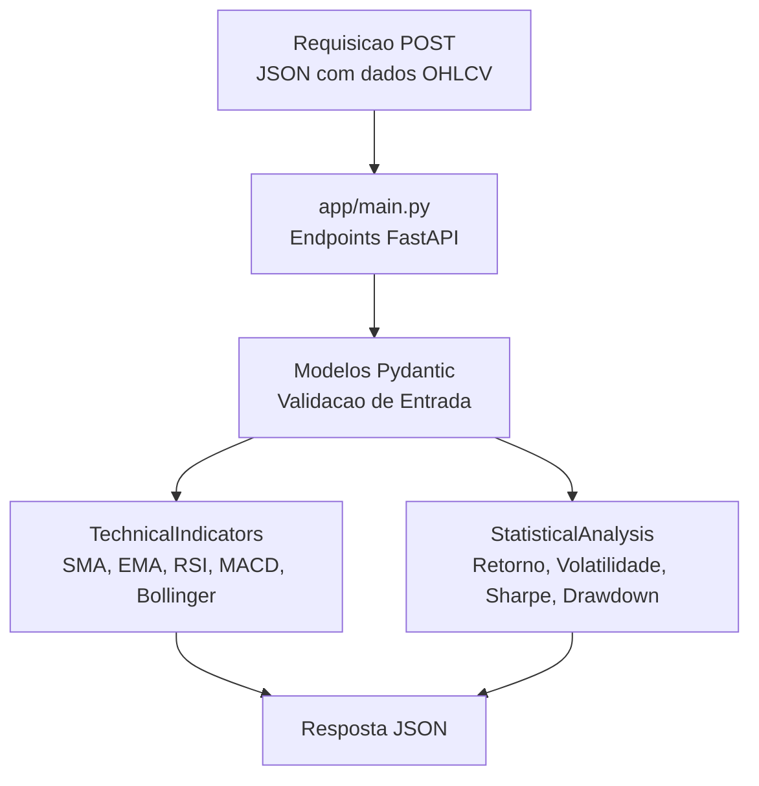
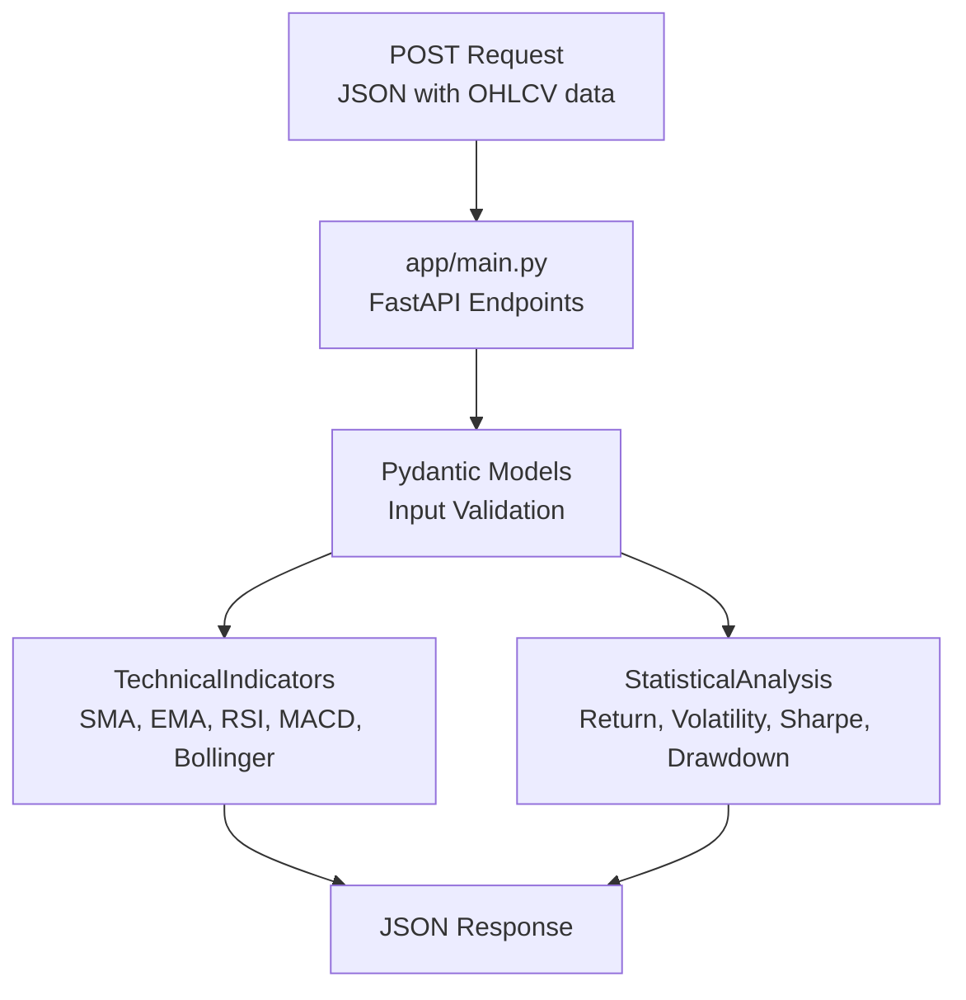

# Quantitative Analysis API

API REST para analise quantitativa de series temporais financeiras, construida com FastAPI.

[](https://python.org)
[](https://fastapi.tiangolo.com)
[](LICENSE)

[Portugues](#portugues) | [English](#english)

---

## Portugues

### Sobre

Microservico FastAPI que recebe dados OHLCV (abertura, maxima, minima, fechamento, volume) via POST e calcula indicadores tecnicos e estatisticas financeiras. Nao possui banco de dados — todo o processamento e feito em memoria sobre os dados enviados na requisicao.

### Funcionalidades

- **Indicadores tecnicos**: SMA, EMA, RSI, MACD e Bandas de Bollinger
- **Estatisticas**: retorno medio anualizado, volatilidade, indice de Sharpe, drawdown maximo, retorno total
- **Validacao**: modelos Pydantic com restricoes (precos > 0, volume >= 0)
- **Documentacao automatica**: Swagger UI em `/docs` e ReDoc em `/redoc`

### Endpoints

| Metodo | Endpoint | Descricao |
|--------|----------|-----------|
| `GET` | `/` | Informacoes da API e lista de endpoints |
| `POST` | `/indicators/sma` | Media Movel Simples (periodo configuravel) |
| `POST` | `/indicators/ema` | Media Movel Exponencial |
| `POST` | `/indicators/rsi` | Indice de Forca Relativa |
| `POST` | `/indicators/macd` | MACD (linha, sinal, histograma) |
| `POST` | `/indicators/bollinger` | Bandas de Bollinger |
| `POST` | `/statistics/summary` | Estatisticas completas da serie |
| `GET` | `/health` | Verificacao de saude do servico |

### Arquitetura



### Estrutura do Projeto

```
quantitative-analysis-api/
├── app/
│   └── main.py            # Aplicacao completa (modelos, indicadores, endpoints)
├── tests/
│   └── test_api.py        # Testes funcionais dos endpoints
├── Dockerfile             # Imagem Docker (python:3.11-slim + uvicorn)
├── requirements.txt
├── LICENSE
└── README.md
```

Toda a logica esta em `app/main.py` (~260 linhas): modelos Pydantic, classes `TechnicalIndicators` e `StatisticalAnalysis` com metodos estaticos, e os endpoints FastAPI que recebem dados, convertem para DataFrame pandas e retornam os resultados.

### Como Usar

```bash
# Clonar e instalar
git clone https://github.com/galafis/quantitative-analysis-api.git
cd quantitative-analysis-api
python -m venv venv
source venv/bin/activate  # Windows: venv\Scripts\activate
pip install -r requirements.txt

# Executar
python app/main.py
# API disponivel em http://localhost:8000

# Testar
pytest tests/ -v
```

### Exemplo de Requisicao

```bash
curl -X POST http://localhost:8000/indicators/sma?period=20 \
  -H "Content-Type: application/json" \
  -d '{
    "symbol": "PETR4",
    "data": [
      {"timestamp": "2024-01-01T00:00:00", "open": 36.5, "high": 37.0, "low": 36.0, "close": 36.8, "volume": 1000000},
      {"timestamp": "2024-01-02T00:00:00", "open": 36.8, "high": 37.5, "low": 36.5, "close": 37.2, "volume": 1200000}
    ]
  }'
```

### Docker

```bash
docker build -t quantitative-analysis-api .
docker run -p 8000:8000 quantitative-analysis-api
```

### Tecnologias

| Tecnologia | Uso |
|------------|-----|
| **FastAPI** | Framework web assincrono |
| **Pydantic** | Validacao de dados de entrada/saida |
| **pandas** | Calculo de indicadores (rolling, ewm) |
| **NumPy** | Operacoes numericas (raiz quadrada para anualizacao) |
| **uvicorn** | Servidor ASGI |

---

## English

### About

FastAPI microservice that receives OHLCV data (open, high, low, close, volume) via POST and calculates technical indicators and financial statistics. No database — all processing is done in memory on the data sent in the request.

### Features

- **Technical indicators**: SMA, EMA, RSI, MACD, and Bollinger Bands
- **Statistics**: annualized mean return, volatility, Sharpe ratio, max drawdown, total return
- **Validation**: Pydantic models with constraints (prices > 0, volume >= 0)
- **Auto-documentation**: Swagger UI at `/docs` and ReDoc at `/redoc`

### Endpoints

| Method | Endpoint | Description |
|--------|----------|-------------|
| `GET` | `/` | API info and endpoint listing |
| `POST` | `/indicators/sma` | Simple Moving Average (configurable period) |
| `POST` | `/indicators/ema` | Exponential Moving Average |
| `POST` | `/indicators/rsi` | Relative Strength Index |
| `POST` | `/indicators/macd` | MACD (line, signal, histogram) |
| `POST` | `/indicators/bollinger` | Bollinger Bands |
| `POST` | `/statistics/summary` | Full series statistics |
| `GET` | `/health` | Service health check |

### Architecture



### Project Structure

```
quantitative-analysis-api/
├── app/
│   └── main.py            # Full application (models, indicators, endpoints)
├── tests/
│   └── test_api.py        # Functional endpoint tests
├── Dockerfile             # Docker image (python:3.11-slim + uvicorn)
├── requirements.txt
├── LICENSE
└── README.md
```

All logic lives in `app/main.py` (~260 lines): Pydantic models, `TechnicalIndicators` and `StatisticalAnalysis` classes with static methods, and FastAPI endpoints that receive data, convert to pandas DataFrame, and return results.

### Usage

```bash
# Clone and install
git clone https://github.com/galafis/quantitative-analysis-api.git
cd quantitative-analysis-api
python -m venv venv
source venv/bin/activate  # Windows: venv\Scripts\activate
pip install -r requirements.txt

# Run
python app/main.py
# API available at http://localhost:8000

# Test
pytest tests/ -v
```

### Request Example

```bash
curl -X POST http://localhost:8000/indicators/sma?period=20 \
  -H "Content-Type: application/json" \
  -d '{
    "symbol": "AAPL",
    "data": [
      {"timestamp": "2024-01-01T00:00:00", "open": 185.0, "high": 186.0, "low": 184.0, "close": 185.5, "volume": 1000000},
      {"timestamp": "2024-01-02T00:00:00", "open": 185.5, "high": 187.0, "low": 185.0, "close": 186.2, "volume": 1200000}
    ]
  }'
```

### Docker

```bash
docker build -t quantitative-analysis-api .
docker run -p 8000:8000 quantitative-analysis-api
```

### Technologies

| Technology | Usage |
|------------|-------|
| **FastAPI** | Async web framework |
| **Pydantic** | Input/output data validation |
| **pandas** | Indicator calculations (rolling, ewm) |
| **NumPy** | Numerical operations (sqrt for annualization) |
| **uvicorn** | ASGI server |

---

## Autor / Author

**Gabriel Demetrios Lafis**
- GitHub: [@galafis](https://github.com/galafis)
- LinkedIn: [Gabriel Demetrios Lafis](https://linkedin.com/in/gabriel-demetrios-lafis)

## Licenca / License

MIT - veja [LICENSE](LICENSE) / see [LICENSE](LICENSE)
