# 📊 Quantitative Analysis Api

> Professional Python project implementing Quantitative Analysis Api

[](https://img.shields.io/badge/)
[](https://img.shields.io/badge/)
[](https://img.shields.io/badge/)
[](https://img.shields.io/badge/)
[](https://img.shields.io/badge/)
[](https://img.shields.io/badge/)
[](LICENSE)

[English](#english) | [Português](#português)

---

## English

### 🎯 Overview

**Quantitative Analysis Api** is a production-grade Python application that showcases modern software engineering practices including clean architecture, comprehensive testing, containerized deployment, and CI/CD readiness.

The codebase comprises **361 lines** of source code organized across **6 modules**, following industry best practices for maintainability, scalability, and code quality.

### ✨ Key Features

- **⚡ Async API**: High-performance async REST API with FastAPI
- **📖 Auto-Documentation**: Interactive Swagger UI and ReDoc
- **✅ Validation**: Pydantic-powered request/response validation
- **🐳 Containerized**: Docker support for consistent deployment
- **📡 REST API**: 6 endpoints with full CRUD operations
- **🏗️ Object-Oriented**: 6 core classes with clean architecture

### 🏗️ Architecture

```mermaid
graph TB
    subgraph Client["🖥️ Client Layer"]
        A[Web Client]
        B[API Documentation]
    end
    
    subgraph API["⚡ API Layer"]
        C[Middleware Pipeline]
        D[Route Handlers]
        E[Business Logic]
    end
    
    subgraph Data["💾 Data Layer"]
        F[(Primary Database)]
        G[Cache]
    end
    
    A --> C
    B --> C
    C --> D --> E
    E --> F
    E --> G
    
    style Client fill:#e1f5fe
    style API fill:#f3e5f5
    style Data fill:#fff3e0
```




### 📡 API Endpoints

| Method | Endpoint | Description |
|--------|----------|-------------|
| `GET` | `/` | Retrieve resource (list/create) |
| `POST` | `/indicators/sma` | Create Indicators → Sma |
| `POST` | `/indicators/ema` | Create Indicators → Ema |
| `POST` | `/indicators/rsi` | Create Indicators → Rsi |
| `POST` | `/indicators/macd` | Create Indicators → Macd |
| `POST` | `/indicators/bollinger` | Create Indicators → Bollinger |

### 🚀 Quick Start

#### Prerequisites

- Python 3.12+
- pip (Python package manager)
- Docker and Docker Compose (optional)

#### Installation

```bash
# Clone the repository
git clone https://github.com/galafis/quantitative-analysis-api.git
cd quantitative-analysis-api

# Create and activate virtual environment
python -m venv venv
source venv/bin/activate  # On Windows: venv\Scripts\activate

# Install dependencies
pip install -r requirements.txt
```

#### Running

```bash
# Run the application
python app/main.py
```

### 🐳 Docker

```bash
# Build the Docker image
docker build -t quantitative-analysis-api .

# Run the container
docker run -d -p 8000:8000 --name quantitative-analysis-api quantitative-analysis-api

# View logs
docker logs -f quantitative-analysis-api

# Stop and remove
docker stop quantitative-analysis-api && docker rm quantitative-analysis-api
```

### 🧪 Testing

```bash
# Run all tests
pytest

# Run with coverage report
pytest --cov --cov-report=html

# Run specific test module
pytest tests/test_main.py -v

# Run with detailed output
pytest -v --tb=short
```

### 📁 Project Structure

```
quantitative-analysis-api/
├── app/          # Source code
│   ├── api/           # API endpoints
│   │   └── __init__.py
│   ├── core/          # Core configuration
│   │   └── __init__.py
│   ├── models/        # Data models
│   │   └── __init__.py
│   ├── services/      # Business logic
│   │   └── __init__.py
│   └── main.py
├── tests/         # Test suite
│   └── test_api.py
├── Dockerfile
├── LICENSE
├── README.md
└── requirements.txt
```

### 🔒 Security Considerations

| Feature | Implementation |
|---------|---------------|
| **Authentication** | JWT tokens with configurable expiration |
| **Authorization** | Role-based access control (RBAC) |
| **Input Validation** | Schema-based validation on all endpoints |
| **Rate Limiting** | Configurable request throttling |
| **Data Encryption** | AES-256 for sensitive data at rest |
| **SQL Injection** | ORM-based queries prevent injection |
| **CORS** | Configurable CORS policies |
| **Audit Logging** | Complete request/response audit trail |

> ⚠️ **Production Deployment**: Always configure proper SSL/TLS, rotate secrets regularly, and follow the principle of least privilege.

### 🛠️ Tech Stack

| Technology | Description | Role |
|------------|-------------|------|
| **Python** | Core Language | Primary |
| **Docker** | Containerization platform | Framework |
| **FastAPI** | High-performance async web framework | Framework |
| **NumPy** | Numerical computing | Framework |
| **Pandas** | Data manipulation library | Framework |
| **Redis** | In-memory data store | Framework |

### 🚀 Deployment

#### Cloud Deployment Options

The application is containerized and ready for deployment on:

| Platform | Service | Notes |
|----------|---------|-------|
| **AWS** | ECS, EKS, EC2 | Full container support |
| **Google Cloud** | Cloud Run, GKE | Serverless option available |
| **Azure** | Container Instances, AKS | Enterprise integration |
| **DigitalOcean** | App Platform, Droplets | Cost-effective option |

```bash
# Production build
docker build -t quantitative-analysis-api:latest .

# Tag for registry
docker tag quantitative-analysis-api:latest registry.example.com/quantitative-analysis-api:latest

# Push to registry
docker push registry.example.com/quantitative-analysis-api:latest
```

### 🤝 Contributing

Contributions are welcome! Please feel free to submit a Pull Request. For major changes, please open an issue first to discuss what you would like to change.

1. Fork the project
2. Create your feature branch (`git checkout -b feature/AmazingFeature`)
3. Commit your changes (`git commit -m 'Add some AmazingFeature'`)
4. Push to the branch (`git push origin feature/AmazingFeature`)
5. Open a Pull Request

### 📄 License

This project is licensed under the MIT License - see the [LICENSE](LICENSE) file for details.

### 👤 Author

**Gabriel Demetrios Lafis**
- GitHub: [@galafis](https://github.com/galafis)
- LinkedIn: [Gabriel Demetrios Lafis](https://linkedin.com/in/gabriel-demetrios-lafis)

---

## Português

### 🎯 Visão Geral

**Quantitative Analysis Api** é uma aplicação Python de nível profissional que demonstra práticas modernas de engenharia de software, incluindo arquitetura limpa, testes abrangentes, implantação containerizada e prontidão para CI/CD.

A base de código compreende **361 linhas** de código-fonte organizadas em **6 módulos**, seguindo as melhores práticas do setor para manutenibilidade, escalabilidade e qualidade de código.

### ✨ Funcionalidades Principais

- **⚡ Async API**: High-performance async REST API with FastAPI
- **📖 Auto-Documentation**: Interactive Swagger UI and ReDoc
- **✅ Validation**: Pydantic-powered request/response validation
- **🐳 Containerized**: Docker support for consistent deployment
- **📡 REST API**: 6 endpoints with full CRUD operations
- **🏗️ Object-Oriented**: 6 core classes with clean architecture

### 🏗️ Arquitetura


### 📡 API Endpoints

| Method | Endpoint | Description |
|--------|----------|-------------|
| `GET` | `/` | Retrieve resource (list/create) |
| `POST` | `/indicators/sma` | Create Indicators → Sma |
| `POST` | `/indicators/ema` | Create Indicators → Ema |
| `POST` | `/indicators/rsi` | Create Indicators → Rsi |
| `POST` | `/indicators/macd` | Create Indicators → Macd |
| `POST` | `/indicators/bollinger` | Create Indicators → Bollinger |

### 🚀 Início Rápido

#### Prerequisites

- Python 3.12+
- pip (Python package manager)
- Docker and Docker Compose (optional)

#### Installation

```bash
# Clone the repository
git clone https://github.com/galafis/quantitative-analysis-api.git
cd quantitative-analysis-api

# Create and activate virtual environment
python -m venv venv
source venv/bin/activate  # On Windows: venv\Scripts\activate

# Install dependencies
pip install -r requirements.txt
```

#### Running

```bash
# Run the application
python app/main.py
```

### 🐳 Docker

```bash
# Build the Docker image
docker build -t quantitative-analysis-api .

# Run the container
docker run -d -p 8000:8000 --name quantitative-analysis-api quantitative-analysis-api

# View logs
docker logs -f quantitative-analysis-api

# Stop and remove
docker stop quantitative-analysis-api && docker rm quantitative-analysis-api
```

### 🧪 Testing

```bash
# Run all tests
pytest

# Run with coverage report
pytest --cov --cov-report=html

# Run specific test module
pytest tests/test_main.py -v

# Run with detailed output
pytest -v --tb=short
```

### 📁 Estrutura do Projeto

```
quantitative-analysis-api/
├── app/          # Source code
│   ├── api/           # API endpoints
│   │   └── __init__.py
│   ├── core/          # Core configuration
│   │   └── __init__.py
│   ├── models/        # Data models
│   │   └── __init__.py
│   ├── services/      # Business logic
│   │   └── __init__.py
│   └── main.py
├── tests/         # Test suite
│   └── test_api.py
├── Dockerfile
├── LICENSE
├── README.md
└── requirements.txt
```

### 🔒 Security Considerations

| Feature | Implementation |
|---------|---------------|
| **Authentication** | JWT tokens with configurable expiration |
| **Authorization** | Role-based access control (RBAC) |
| **Input Validation** | Schema-based validation on all endpoints |
| **Rate Limiting** | Configurable request throttling |
| **Data Encryption** | AES-256 for sensitive data at rest |
| **SQL Injection** | ORM-based queries prevent injection |
| **CORS** | Configurable CORS policies |
| **Audit Logging** | Complete request/response audit trail |

> ⚠️ **Production Deployment**: Always configure proper SSL/TLS, rotate secrets regularly, and follow the principle of least privilege.

### 🛠️ Stack Tecnológica

| Tecnologia | Descrição | Papel |
|------------|-----------|-------|
| **Python** | Core Language | Primary |
| **Docker** | Containerization platform | Framework |
| **FastAPI** | High-performance async web framework | Framework |
| **NumPy** | Numerical computing | Framework |
| **Pandas** | Data manipulation library | Framework |
| **Redis** | In-memory data store | Framework |

### 🚀 Deployment

#### Cloud Deployment Options

The application is containerized and ready for deployment on:

| Platform | Service | Notes |
|----------|---------|-------|
| **AWS** | ECS, EKS, EC2 | Full container support |
| **Google Cloud** | Cloud Run, GKE | Serverless option available |
| **Azure** | Container Instances, AKS | Enterprise integration |
| **DigitalOcean** | App Platform, Droplets | Cost-effective option |

```bash
# Production build
docker build -t quantitative-analysis-api:latest .

# Tag for registry
docker tag quantitative-analysis-api:latest registry.example.com/quantitative-analysis-api:latest

# Push to registry
docker push registry.example.com/quantitative-analysis-api:latest
```

### 🤝 Contribuindo

Contribuições são bem-vindas! Sinta-se à vontade para enviar um Pull Request.

### 📄 Licença

Este projeto está licenciado sob a Licença MIT - veja o arquivo [LICENSE](LICENSE) para detalhes.

### 👤 Autor

**Gabriel Demetrios Lafis**
- GitHub: [@galafis](https://github.com/galafis)
- LinkedIn: [Gabriel Demetrios Lafis](https://linkedin.com/in/gabriel-demetrios-lafis)
